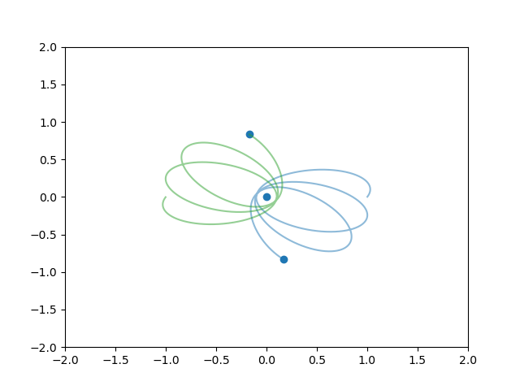
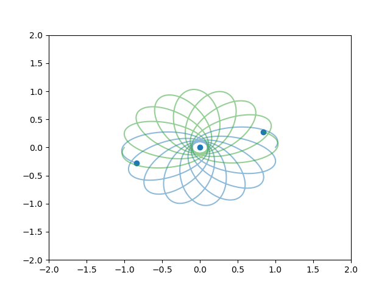

# Three-Body Simulation

A Python-based gravitational simulation of the three-body problem with real-time visualization.



## Requirements

- Python 3.x
- numpy
- matplotlib
- pyyaml

## Installation

```bash
pip install -r pkg.txt
```

## Usage
s
```bash
python main.py
```

## Configuration

Edit [config.yaml](config.yaml) to adjust:
- Simulation parameters (timestep, steps, gravitational constant)
- Initial conditions (mass, position, velocity) for each body
